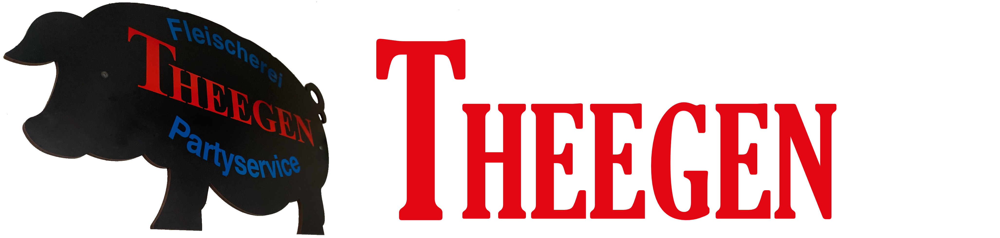

# Theegen.de

This Github Repo contains the source code for the website of a small German Butcher hosted on github pages.

The Website is created with [Hugo](https://gohugo.io/) and the [Meghna Theme from Theme Fischer](https://github.com/themefisher/meghna-hugo). Additonal Changes to the default theme parts where made when needed and are findable in the /layouts/ folder.

## 🔧Local development

```bash
# clone the repository
git clone https://github.com/GermanButcher/Theegen.de.git

# cd in the project directory
$ npm run project-setup

# Start local dev server
$ npm run dev
```
